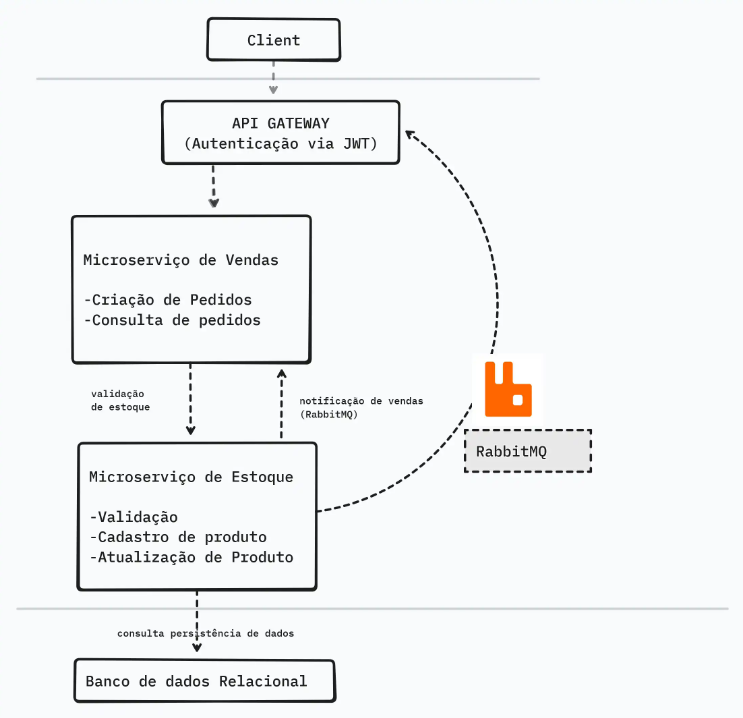

# E-CommerceMicroservices: API Gateway, Sales Service & Products Service

A simple .NET microservices demo demonstrating a purchase workflow using an API Gateway, Sales Service, and Products Service.

## Overview

This project consists of three independent services:

- **API Gateway**  
  Acts as the entry point for clients. Routes requests to internal services without containing business logic.

- **Sales Service**  
  Handles the purchase workflow. Validates requests, retrieves product data from the Products Service, checks stock and price, and finalizes purchases.

- **Products Service**  
  Manages product catalog and stock. Provides product data and updates stock during purchases.

## Architecture

- Services communicate via HTTP using `HttpClientFactory`.
- No shared models: each service maintains its own domain models.
- API Gateway is “thin” — it only routes requests and can handle authentication/logging.

## Features

- Independent, decoupled services  
- Proper separation of concerns  
- Pass-through HTTP proxying via API Gateway  
- Service-to-service communication  
- Realistic purchase flow across multiple services